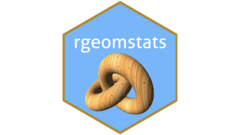

<!-- README.md is generated from README.Rmd. Please edit that file -->

```{r, include = FALSE}
knitr::opts_chunk$set(
  collapse = TRUE,
  comment = "#>",
  fig.path = "man/figures/README-",
  out.width = "100%"
)
```

# rgeomstats <a href="https://lmjl-alea.github.io/rgeomstats/"></a>

<!-- badges: start -->
[](https://github.com/LMJL-Alea/rgeomstats/actions/workflows/R-CMD-check.yaml)
[](https://github.com/LMJL-Alea/rgeomstats/actions)
[](https://app.codecov.io/gh/LMJL-Alea/rgeomstats)
[](https://github.com/LMJL-Alea/rgeomstats/actions)
[](https://CRAN.R-project.org/package=rgeomstats)
<!-- badges: end -->

The goal of **rgeomstats** is to provide accessibility to the [**Geomstats**](https://geomstats.github.io) Python library for the community of `R` users through an R interface that mimics as closely as possible the carefully designed Python API.

## Installation

You can install the development version of **rgeomstats** via:

``` r
# install.packages("remotes")
remotes::install_github("LMJL-Alea/rgeomstats")
```

## Example

You can instantiate the space $\mathrm{SO}(3)$ of 3D rotations and sample random points in this space as follows:

```{r}
library(rgeomstats)
so3 <- SpecialOrthogonal(n = 3)
spl <- so3$random_point(n_samples = 5)
dim(spl)
```

All Geomstats-like computations are stored in arrays. In particular, sample IDs are always stored along the first dimension. Hence, it is always possible to convert a sample into a list via:

```{r}
purrr::array_tree(spl, margin = 1)
```

